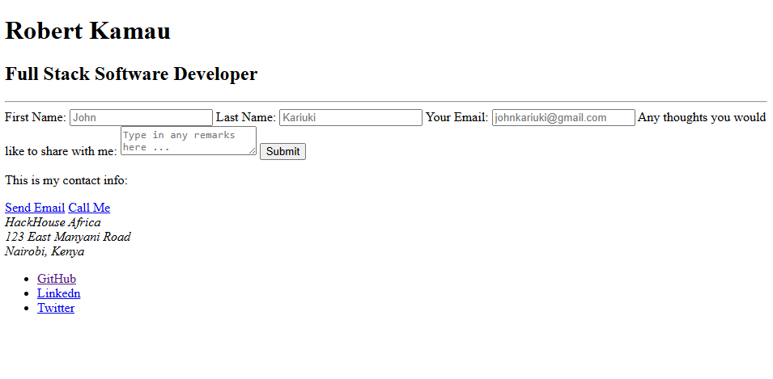
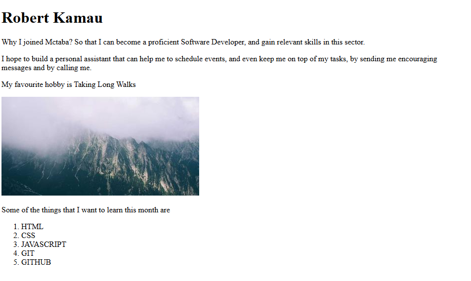

# week-1-day-1-assignment

## This is my first assignment at Mctaba Labs

- To run this code, you just need to start the html files in ypur terminal. It will work.

- This is the output of the Business Card Page

- This is the output of the Index Page

- This is the output of the Schedule Page
